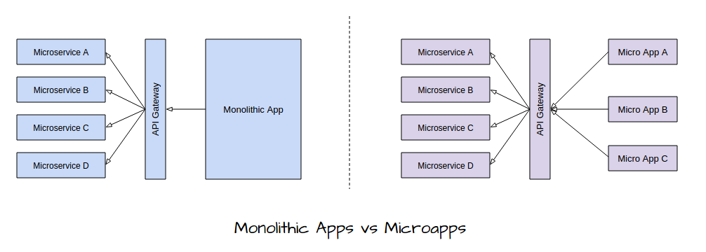

# Apphive - Open-source Microapps Framework

Apphive is an open-source framework to build Microapps.

## What is Microapps

Microapps architecture, or simply microapps is an architectural style that structures an UI applications as a collection of loosely coupled smaller independent applications.  

Microapps can be considered as the UI counterpart of the the Microservices.
   

## Benefits of the Microapps

 * Easy to maintain.
 * Manageable to technology upgrades. 
    - For example if you want to upgrade Angular1.x monolithic application to Angular2.x, then you need to upgrade the whole application across the board at once. Mostly it will be a rewrite of entire UI at once. But if you use Microapps architecture then you can upgrade the application gradually, since entire application consists of smaller independent applications.
 * Focused features.
   - This will prevent the UI feature bolt.
 * Better user experience.
 * Application harmony.
   - Microapps can also bring software application harmony at enterprise, which will consolidate SSO requirement with in Microservices solutions and among independent systems belong to an Organization.

## What is Apphive

Apphive is open-source microapps framework which will allow applications to developed as group of independent smaller applications. Apphive will provide the shelve in order to organize and keep these independent smaller applications together.

